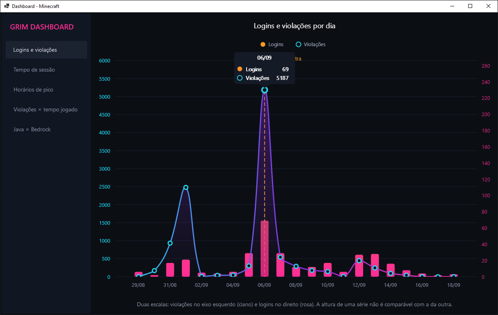
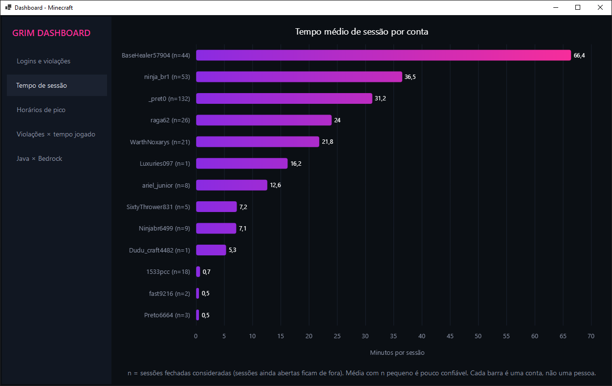
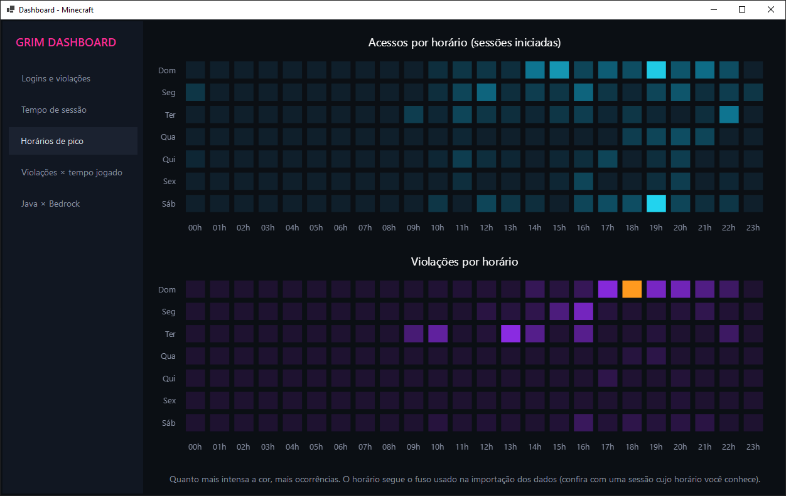
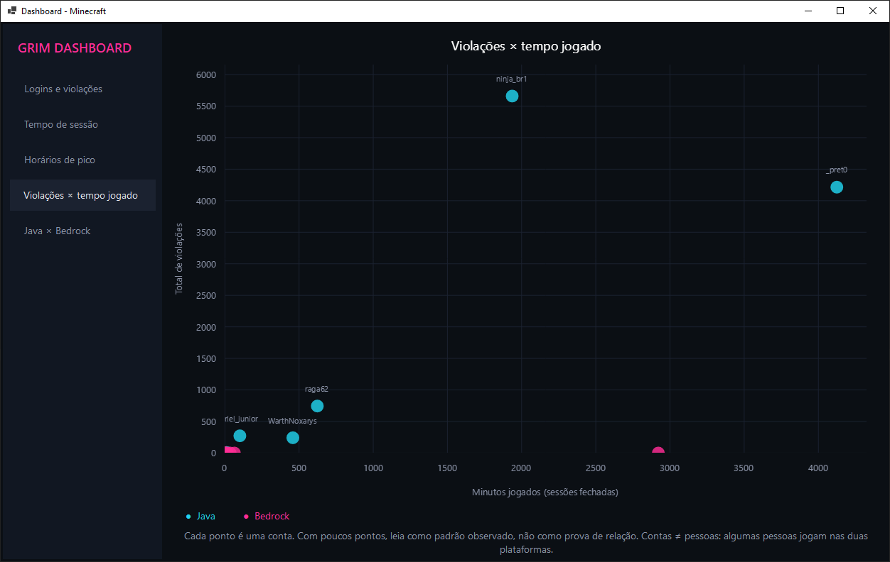
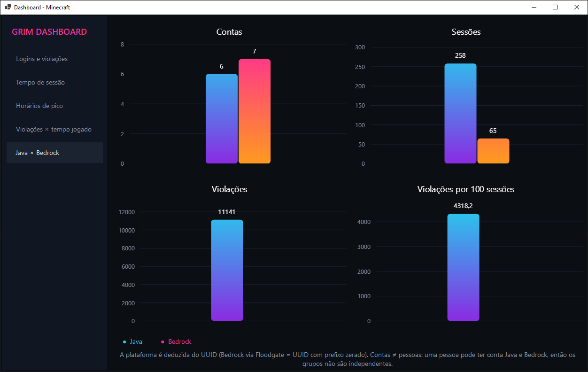

# Access Patterns and Anticheat-Recorded Violations on a Minecraft Server: Analysis Before and After a Moderation Intervention

> Versão em português: [README.pt-BR.md](README.pt-br.md)

Final project for the Scientific Methodology course — Database Technology program.

---

## 1. Title and Context

### Research question

> How do players' access patterns (login frequency, session length, time of day and platform) relate to the violations recorded by the **GrimAC** anticheat on a small Minecraft server, and how did this picture change after the moderation intervention of **Sep 6, 2026**?

### Hypotheses

| # | Hypothesis |
|---|------------|
| H1 | The number of violations decreased after an additional anticheat was installed on Sep 6, 2026. |
| H2 | Accounts with more violations have different session lengths than the others. |
| H3 | Violations are just a consequence of playing more (play volume). |
| H4 | Access is concentrated at specific times (weekends), and violations follow the same pattern. |
| H5 | Recorded violations differ between Java and Bedrock accounts. |

### Rationale

Small community servers are usually moderated "by eye", without data showing whether the detection tools and the rules adopted actually work. Cheating in online games hurts other players' experience and requires a response from the administration (see reference [8]). This work uses the records the server already produces to answer, in a descriptive and verifiable way, what the data show and what they do **not** allow us to claim.

### Scope and interventions

This is a **descriptive case study** of a single server, with no control group. Two interventions took place: (1) an additional anticheat was installed on **Sep 6, 2026**, and (2) a rule that automatically kicks a player after 30 violation points (VL) was adopted at a later date, whose exact day was not recorded.

---

## 2. Data Source

| Database | Origin | Content used |
|----------|--------|--------------|
| `history.v1.db` (SQLite) | **GrimAC** plugin, on the author's Paper server | Players, sessions (start/end), violations (level, check type, timestamp) |
| `authme.db` (SQLite) | **AuthMe** plugin, on the same server | Only the registration date per player name |
| `ops.json` | Paper server | Accounts with operator permission |

**Period:** sessions and logins from Aug 29, 2026 to Sep 18, 2026; violations from Aug 30, 2026 to Sep 16, 2026.
**Volume in the analyzed database:** 13 accounts (6 Java and 7 Bedrock), 323 sessions and 11,141 violations.

**Origin and licensing.** The data were generated by the author's own server; they do not come from third parties or a public source. The raw databases are **not** included in this repository. The tools used have their own licenses, listed in the references (check each project's license in its official repository).

**Privacy.** The sensitive AuthMe columns (password, registration IP and login IP) were **not imported**. Players are identified only by in-game nickname, and no account is linked to a real person in this report. *(To confirm: the participants know that their gameplay records were used in this work.)*

---

## 3. Methodology

### 3.1 Pipeline

```
GrimAC/AuthMe (SQLite) ──► Java importer ──► MySQL ──► Spring Boot API (JdbcTemplate) ──► C# dashboard (WinForms + LiveCharts2)
```

The report is reproducible: every number and chart below comes from an API endpoint displayed in the dashboard.

### 3.2 Cleaning and transformation

- **Identifiers:** UUIDs stored as BLOBs were converted to text.
- **Dates:** epoch timestamps were converted to date and time.
- **Platform (Java/Bedrock):** inferred from the UUID. Bedrock players joining through Geyser/Floodgate receive a UUID whose 64 most significant bits are zero; all others were classified as Java. The rule was checked manually against the known players.
- **Sensitive data:** password and IP columns were dropped during the import.
- **Open sessions:** excluded from the session-length averages (only sessions with a recorded end are used).
- **Days without records:** filled with zero in the daily charts so the time axis is continuous.
- **Aggregations:** sessions and violations were summed in separate subqueries before being joined to the player. Joining both tables in the same `JOIN` would repeat each session once per violation and inflate the totals.

### 3.3 Analyses

1. Logins (started sessions) and violations **per day**, with a marker on Sep 6.
2. **Average session length** per account, with the number of sessions (n).
3. **Heatmap** of accesses and violations by day of the week × hour.
4. **Scatter plot** of violations × total time played, per account.
5. **Java × Bedrock**: accounts, sessions, violations and violations per 100 sessions.

All analyses are **descriptive**; no statistical tests were applied, since the number of accounts (13) would not support them.

### 3.4 How to reproduce

1. Create the MySQL database using the schema in `database/` and run the importer (`importarDados.java`) pointing to the server's SQLite databases.
2. Start the API: `cd backend && mvn spring-boot:run` (port 8080).
3. Open the dashboard project in Visual Studio and run it.

| Endpoint | Purpose |
|----------|---------|
| `/api/login/por-dia` | Logins per day |
| `/api/violacoes/por-dia` | Violations per day |
| `/api/jogadores/tempo-medio-sessao` | Average session length |
| `/api/sessoes/por-hora`, `/api/violacoes/por-hora` | Heatmaps |
| `/api/jogadores/violacoes-vs-tempo` | Scatter plot |
| `/api/jogadores/por-plataforma` | Java × Bedrock |

### 3.5 Import validation (data clarity)

After each load, the MySQL counts were compared with those of the source (source × destination reconciliation). This check revealed a problem in the first version of the importer:

- **Symptom:** the source (`grim_violations`) had **11,141** violations (Aug 30 to Sep 16, 2026), but MySQL had only **2,509**.
- **Cause:** the `violacoes` table had a unique key over (session, check type, timestamp) and the importer used `ON DUPLICATE KEY UPDATE`. Because the timestamp is stored with one-second precision, violations of the same type, in the same session and in the same second were merged into a single row.
- **Fix:** each violation now stores the **original Grim identifier** (`grim_id`), used as the unique key. The import remains repeatable (running it twice does not duplicate rows) and no record is merged.
- **Result after the fix:** source = 11,141 violations, destination = 11,141 (no violation was left without a matching player). In addition, `COUNT(*)` = `COUNT(DISTINCT grim_id)` = 11,141 and there is no null `grim_id` (the column is `NOT NULL`), which means every destination row corresponds to exactly one source record.
- **Repeatability:** the importer was run a second time and the count stayed at 11,141, i.e., re-running the load updates the existing records instead of duplicating them.
- **Consequence for the analysis:** all charts and numbers in this report were regenerated with the corrected data; the values from the first import were discarded.

The **time zone** was also checked: the source timestamps, converted to UTC−3 (Brasília time), match those in MySQL.

---

## 4. Results and Limitations

> Results computed from the 11,141 corrected records (see 3.5). Values marked "≈" were read from the dashboard charts; the exact value appears when hovering over the point or bar. The dashboard labels are in Portuguese and its dates use the dd/MM format.

### 4.1 Logins and violations per day



- There are two violation peaks: **≈2,500 on Sep 1** and **5,187 on Sep 6**. Together, these two days account for about two-thirds of all violations in the period.
- After Sep 6 the values stay in the hundreds (≈540 on Sep 7, ≈300 on Sep 8), with a small rise on Sep 12 (≈450), and get close to zero from mid-September on.
- Logins also peaked on Sep 6 (69) and returned to ≈10 to 30 per day in the following days.
- Each "violation" is one Grim record (one alert). A single episode can generate hundreds of records, so the peaks indicate intense episodes, not thousands of distinct cheating acts.

**What can be said:** the drop is *consistent with* an effect of the additional anticheat.
**What cannot be said:** that the anticheat caused the drop. The Sep 1 peak also disappeared with no intervention at all; most of the volume was concentrated in a few accounts; logins returned to their usual level together with the violations; and the measuring instrument (Grim itself) may have changed sensitivity when the second anticheat was added.

### 4.2 Average session length



- The highest average (≈66 min) belongs to a Bedrock account with **no** violations. The two Java accounts with the most violations are at ≈31–37 min, close to accounts with far fewer violations (≈22–24 min).
- There is no clear difference in session length between accounts with many and with few violations (H2 **not supported**).
- Accounts with n = 1 or 2 do not allow any conclusion. Some accounts have sessions of ≈30 s, which are probably reconnections or failed logins rather than actual play.

### 4.3 Peak hours



- **Accesses** are concentrated on weekends, from ≈14:00 to 22:00, peaking around 19:00 (H4, first part, **supported**).
- **Violations** do not follow this pattern: the most intense regions (Sunday from 17:00 to 20:00, peaking at 18:00, and Tuesday, in the morning and around 13:00) coincide with the days of the two isolated peaks (Sep 1 was a Tuesday and Sep 6 was a Sunday). This points to **two one-off events**, not a recurring cheating time. Saturday, despite heavy access, has almost no violations.
- With about three weeks of data, each weekday appears only two or three times, so a single event dominates the color scale.

### 4.4 Violations × time played



- The accounts with the most play time are not the ones with the most violations: a Bedrock account with ≈2,900 min has practically no violations; a Java account with ≈1,900 min has ≈5,650; and another Java account, with ≈4,100 min (the longest of all), has ≈4,200, fewer than the previous one.
- Violations are concentrated in a few accounts, all Java: the top two account for about 89% of the total (≈9,900 of 11,141). An account belonging to the administrator also appears with ≈745 violations, which illustrates that a **recorded** violation does not equal cheating (there are false positives and tests).
- H3 **not supported**: time played, on its own, does not explain the pattern.

### 4.5 Java × Bedrock



| | Java | Bedrock |
|---|---|---|
| Accounts | 6 | 7 |
| Sessions | 258 | 65 |
| Violations | 11,141 | 0 |
| Violations per 100 sessions | ≈4,318 | 0 |

- Java has about 4× more sessions, but even **normalizing per session** the difference remains: if violations were proportional to session volume, Bedrock would have roughly 2,800, not zero.
- **Caveats:** (a) Grim is configured identically for everyone, but it may behave differently with players joining through Geyser, so the result should be read as "**0 recorded violations**", not as "they do not cheat"; (b) almost all violations come from two Java accounts; (c) some people have accounts on both platforms, so the groups are not independent.

### 4.6 Summary

| Hypothesis | Result | Conclusion allowed |
|---|---|---|
| H1 — drop after Sep 6 | Sharp drop observed | Consistent with the anticheat; causality **not** demonstrated |
| H2 — different session lengths | No clear difference | Not supported |
| H3 — play volume only | Volume does not explain it | Not supported |
| H4 — access and violations by time | Access: weekends. Violations: two one-off events | Access supported; no weekly pattern for violations |
| H5 — Java × Bedrock | ≈4,318 × 0 per 100 sessions | Difference in the records; cause **not** identified |

### 4.7 Limitations

- **Small sample:** 13 accounts and about three weeks. No statistical test is appropriate, and the results do not generalize to other servers.
- **Account ≠ person:** some people play with two accounts (Java and Bedrock). This splits per-player totals and makes the Java/Bedrock groups non-independent. In addition, the server runs with `online-mode=false`, which does not guarantee the identity of whoever uses a nickname.
- **No control group** and **two interventions** (the additional anticheat and the automatic kick at 30 VL) that this study cannot separate.
- **The instrument is Grim itself:** recorded violations are not the same as cheating (there are false positives), and an additional anticheat may prevent Grim from recording violations that would keep happening.
- **Counting unit:** each violation is a Grim alert, and a single episode can generate hundreds of them. The totals measure alert intensity, not the number of incidents or cheaters.
- **Bedrock with 0 recorded violations** does not prove the absence of cheating (see 4.5).
- **"Login" = started session**, including reconnections and sessions lasting a few seconds, not distinct players.
- **Time zone:** timestamps were converted to UTC−3 (Brasília time) during the import, and the conversion was checked by comparing source and destination times.
- **Two scales** in the daily chart: the height of the columns (logins) and of the line (violations) is not comparable.

### 4.8 Future work

Compare each account **before × after** Sep 6; group accounts by person; count **incidents** (for example, violations grouped by account and minute) in addition to alerts; analyze violations by **check type** (the endpoint already exists in the API); and, if possible, obtain a comparison period without intervention.

---

## 5. References

<!-- Check each URL, title and access date before submitting. -->

[1] GRIMANTICHEAT. *GrimAC* (anticheat for Minecraft). Official repository and documentation on GitHub. Source of the violation and session data.

[2] PAPERMC. *Paper* (Minecraft server). Documentation available at papermc.io.

[3] AUTHME. *AuthMe Reloaded* (authentication plugin). Official repository on GitHub.

[4] GEYSERMC. *Geyser* and *Floodgate* (Bedrock player support). Documentation available at geysermc.org.

[5] VMWARE/BROADCOM. *Spring Boot* and *Spring JDBC (JdbcTemplate)*. Documentation available at spring.io.

[6] ORACLE. *MySQL* Reference Manual. Documentation available at dev.mysql.com.

[7] MICROSOFT. *.NET* and *Windows Forms*. Documentation available at learn.microsoft.com; LIVECHARTS. *LiveChartsCore/LiveCharts2*; and *SkiaSharp* (charting libraries), official repositories on GitHub.

[8] COMO lidar com trapaceiros de jogos online: práticas recomendadas [How to deal with online game cheaters: best practices]. *LinkedIn*. Available at: https://pt.linkedin.com/advice/0/what-best-practices-dealing-online-game-cheaters?lang=pt. Accessed on Sep 20, 2026. *(Used only as background for the rationale, not as evidence for the results.)*

---

*Source code: backend (Java/Spring Boot), data importer and dashboard (C#/WinForms) in this repository.*
